# Reinforcement Machine Learning

This is my reinforcement machine learning robot implementation for the Robocode framework.

> Robocode is an exciting, interactive environment designed by IBM, originally as a teaching aid in
> Java. However it has since become a popular tool for the exploration of topics in artificial
> intelligence (AI), including neural networks and reinforcement learning (RL). 

## Summary

- Developed a Java Robocode agent that implements Temporal Difference Reinforcement Learning
- Implemented a feed-forward Neural Network trained via Back Propagation algorithm, minimizing the need for state
space reduction, while improving generalization
- Adjusted learning parameters and exploration rates, increasing winning rate from 10% to 98% within 3000 trials

## Requirements

1. Implement Multi-layer perceptron and train it using the error-backpropagation algorithm
2. Reinforcement Learning using a Look-Up-Table (LUT), using it in Robocode.
3. Reinforcement Learning with Back Propagation

## Reinforcement Learning using a Look-Up-Table (LUT)

#### Learning Progress

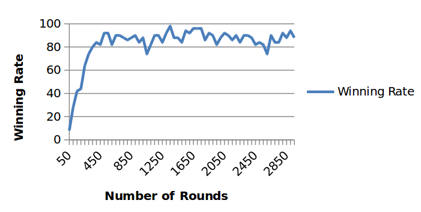

- Robot learns a lot initially, reaching 80% winning rate in 350 rounds. 
- Total # of Round: 3000.
- Epsilon: 0.2 (where e= 1.0 is 100% random)

#### Comparing Performance of On-Policy vs Off-Policy learning

I compare the difference between QLearning and SARSA, in both, the training stage (e=0.2), and the performance after that (e=0).

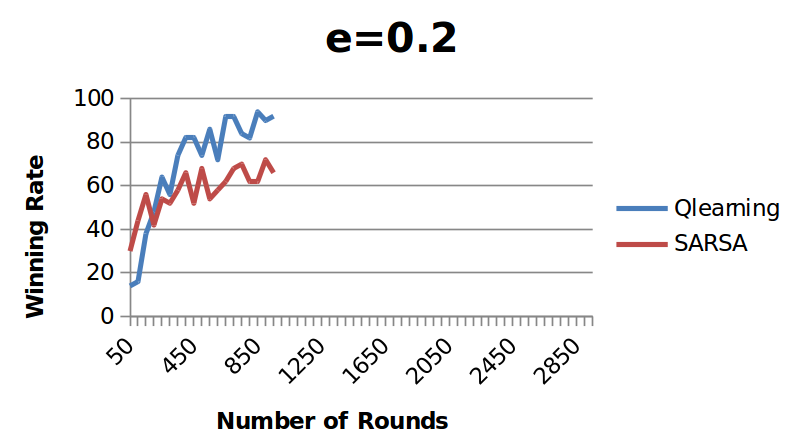

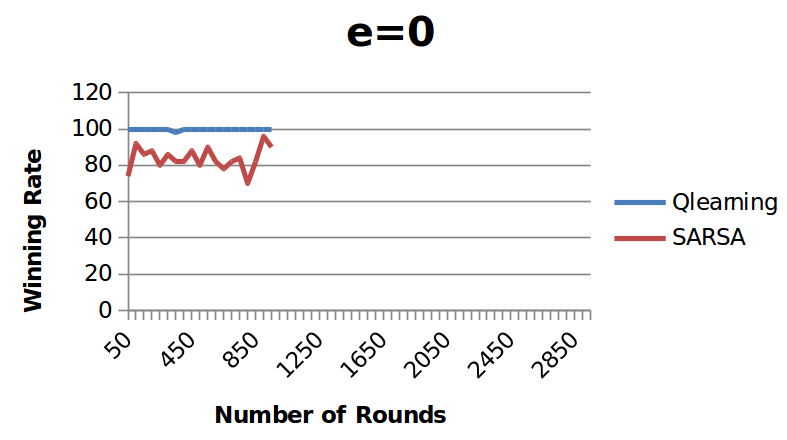

- As expected, QLearning works better for robocode.
    - On-Policy: SARSA.
    - OFF-Policy: Q-Learning

#### Comparing Performance With and Without Intermediate Rewards

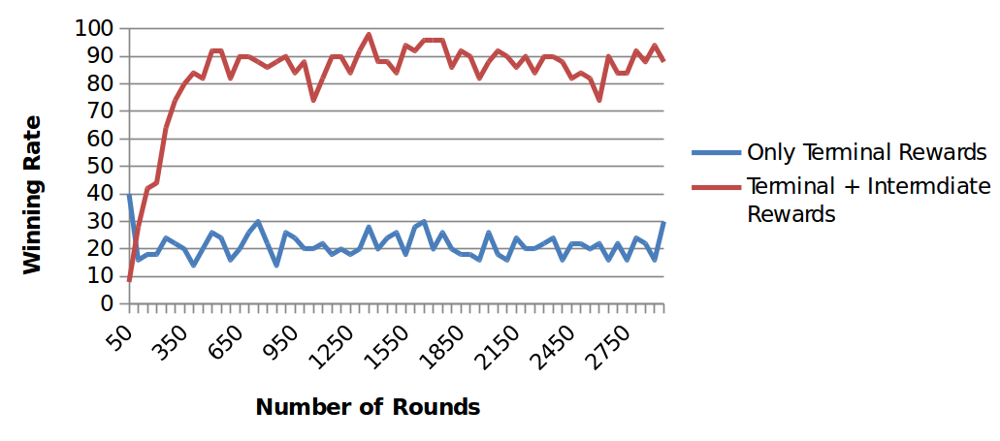

Using only terminal rewards works terribly with tasks like robocode.

#### Comparing Performance of Various Exploration Rates

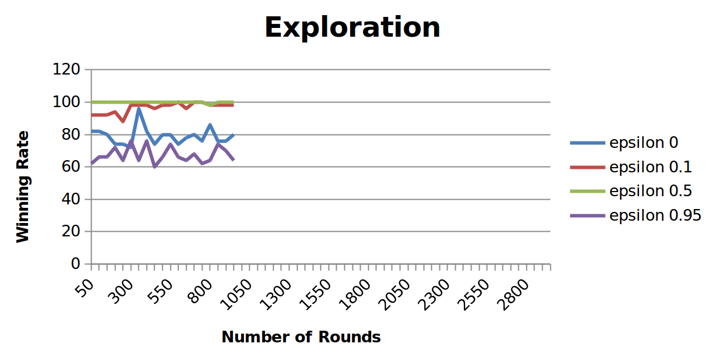

- Training Stage: 1000 rounds, for varies epsilon values.
- Performance Stage: epsilon is then set to 0.
- The graph shows the performance stage (e=0), using specific epsilon values at the training stage.
- Very high or very low epsilon values do not yield the best results.
- From those tested epsilon values, e=0.5 achieved the highest winning rate (99%).

## Reinforcement Learning with Back Propagation

####  Architecture of Neural Network

I used one Neural Network, with a single output. Following is the diagram for the Neural Network:

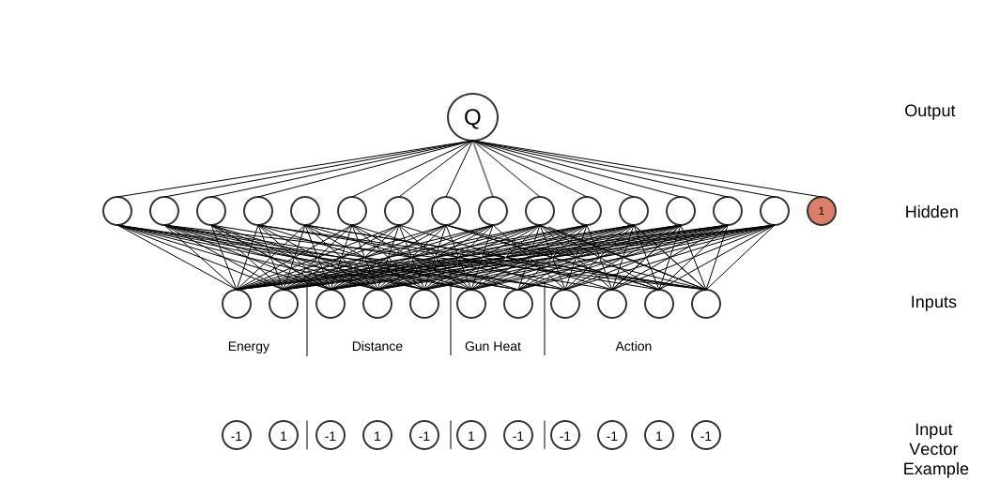

#### Off-line Training

Neural Network with feed forward was used, with back propagation training. I captured the Q values from the Part 2 LUT. The values were stored in a table (State x Action). I had to convert State-Action pairs into Input Vectors for the Neural Network, like shown in the previous graph. The Q values were stored in an array to train the Neural Network for the desired output. The Input Vectors used bipolar representation. More details about input representation is provided in the answer for Q1(C). The Q values in LUT had a range of +-2100, and I scaled them down to +-1 in the Neural Network (for easier implementation).

#### Results of Training the NN Using LUT

Following is the result of training the Neural Network using contents of the LUT from Part 2:

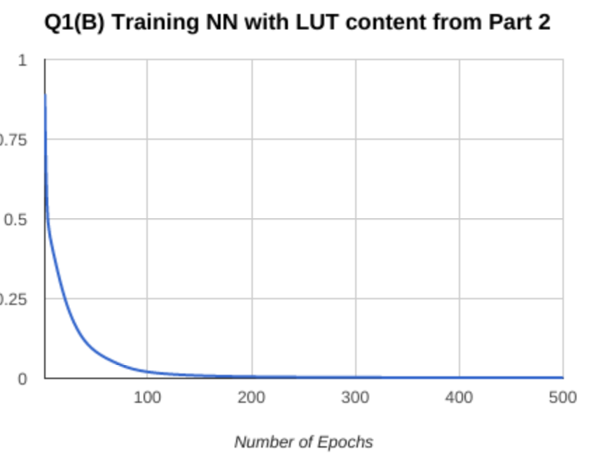

In the graph, I’m only showing 500 epochs. The error keeps getting smaller the longer the program runs. After 1000 epochs, the RMS error reaches 0.00078.

- Using intuition and trial and error, I found the following to give the best results for my setup:
    - Number of Inputs: 21 (5 for Energy, 10 of Distance, 2 for GunHeat, and 4 for Action).
    - Number of Hidden Neurons: 15 (any range from 10-15 gave me similar results).
    - Learning Rate: 0.2
    - Momentum: 0.9
    - LUT Q Values: Range [-2100, 2100]. This was scaled down when teaching the NN.
    - Neural Network Output: Range [-1, 1]

#### Dimensionality Reduction

Following is a side-by-side comparison of the input representation used in Part 2 with that used by the neural net in Part 3:

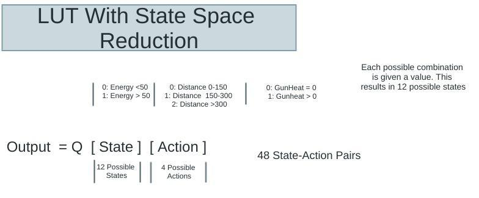

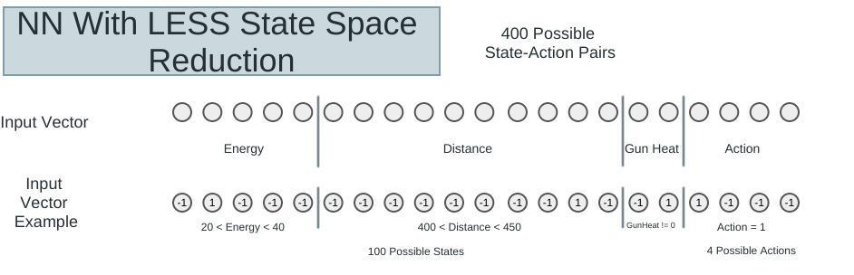

The Output ranges from [-1, 1].

Following is the results of my robot from Part 2 (LUT with state space reduction) versus the neural net based robot using less state space reduction.

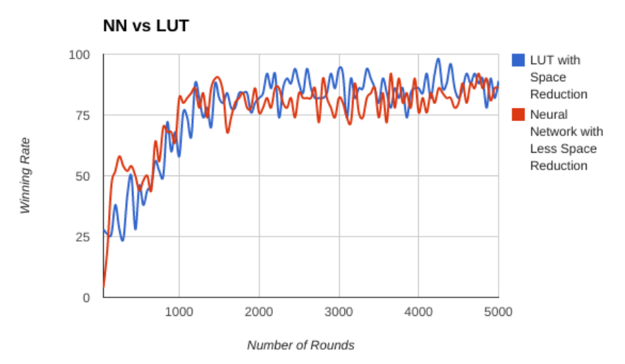

The results appear to be very similar. The trade-off of approximation in the NN seemed to be compensated by the fact I am using less space reduction.

State space reduction is required when considering LUT, otherwise we would end up with a massive table of state-action pairs. Neural Network, due to approximation, uses less memory compared to LUT, for the same number of states. To establish generalization in LUT, every possible pair needs to be visited. If the state space is not reduced, not all rows will be visited. This will result in some rows being visited frequently, while others are not visited at all (no Q values!). However, in Neural Networks, visiting every pair is not required, since the Q values are approximated using weights. The Q values for the entire state space are also not required to be stored, and they can be generated anytime using forward propagation.

#### Winning Rate

Best winning rate observed is **98%**.

Obtaining the results was done in two stages - online training, and performance.

1. Online Training Stage:
I set the epsilon value to 0.8 (high exploration), and let the robot play 3000 rounds, as shown in the following graph:

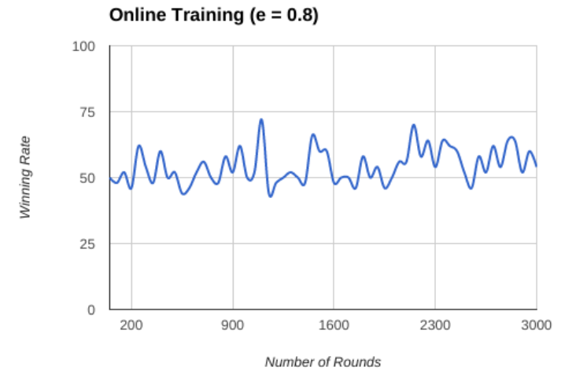

2. Performance Stage:
After training the robot in the previous stage, I turned off the exploration function (epsilon = 0), and let the robot play for 500 rounds, as shown in the following graph:

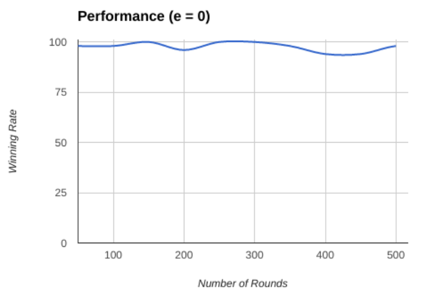

The graph shows an average winning rate of 98% in those 500 rounds.

Following is the e(s) plot for three, randomly selected, state-action pairs:

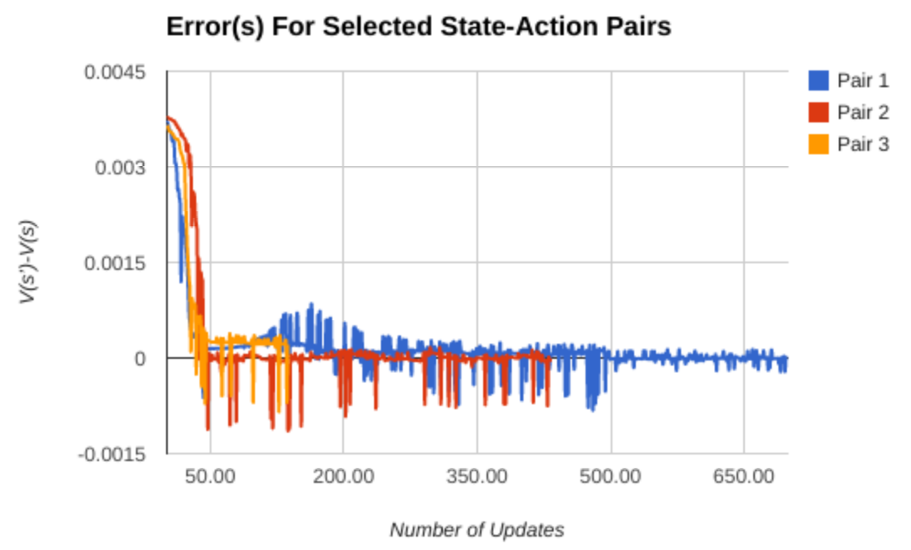

This result is captured by playing 1000 battles. 
- Observations:
    - The more a pair is visited, the smaller its error gets.
    - The number of state-action visits varies - Pair 1 was visited a lot more than Pair 3.

Following is the win rate against number of battles:

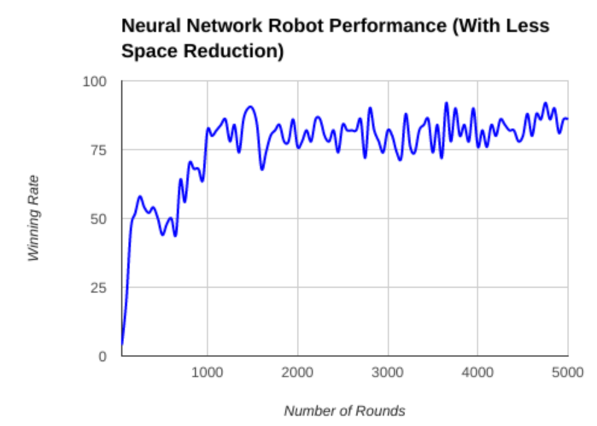
